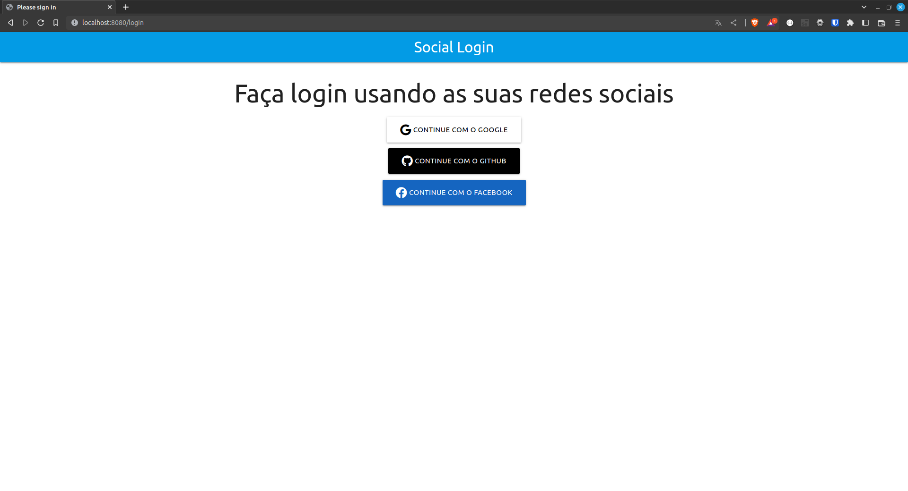
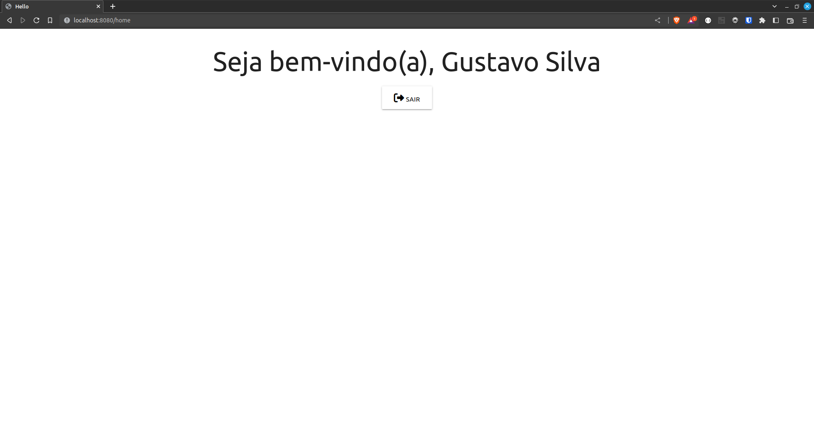

# Social Login com Spring

Aplicação que faz login a partir de redes sociais usando o protocolo oauth2.


## Funcionalidades

- Login usando conta do Google
- Login usando conta do Github
- Login usando conta do Facebook


## Rodando localmente

Clone o projeto

```bash
  git clone git@github.com:gasfgrv/social-login-spring.git
```

Entre no diretório do projeto

```bash
  cd social-login-spring
```

Instale as dependências e monte o Jar

```bash
  gradle build
```

Inicie o servidor

```bash
  java \
    -Dspring.security.oauth2.client.registration.facebook.clientId=${OAUTH_FACEBOOK_CLIENT} \
    -Dspring.security.oauth2.client.registration.facebook.clientSecret=${OAUTH_FACEBOOK_SECRET} \
    -Dspring.security.oauth2.client.registration.github.clientId=${OAUTH_GITHUB_CLIENT} \
    -Dspring.security.oauth2.client.registration.github.clientSecret=${OAUTH_GITHUB_SECRET} \
    -Dspring.security.oauth2.client.registration.google.clientId=${OAUTH_GOOGLE_CLIENT} \
    -Dspring.security.oauth2.client.registration.google.clientSecret=${OAUTH_GOOGLE_SECRET} \
    -jar build/libs/oauthsocial-0.0.1-SNAPSHOT.jar
```


## Variáveis de Ambiente

Para rodar esse projeto, você vai precisar adicionar as seguintes variáveis de ambiente:

| Variável              | Valor                                     |
|-----------------------|-------------------------------------------|
| OAUTH_FACEBOOK_CLIENT | Cliente oauth da conta na Meta            |
| OAUTH_FACEBOOK_SECRET | Senha do cliente oauth da conta na Meta   |
| OAUTH_GITHUB_CLIENT   | Cliente oauth da conta no Github          |
| OAUTH_GITHUB_SECRET   | Senha do cliente oauth da conta no Github |
| OAUTH_GOOGLE_CLIENT   | Cliente oauth da conta no Google          |
| OAUTH_GOOGLE_SECRET   | Senha do cliente oauth da conta no Google |


## Screenshots





## Stack utilizada

**Front-end:** Thymeleaf

**Back-end:** Spring e Gradle


## Autores

- [@gasfgrv](https://www.github.com/gasfgrv)

